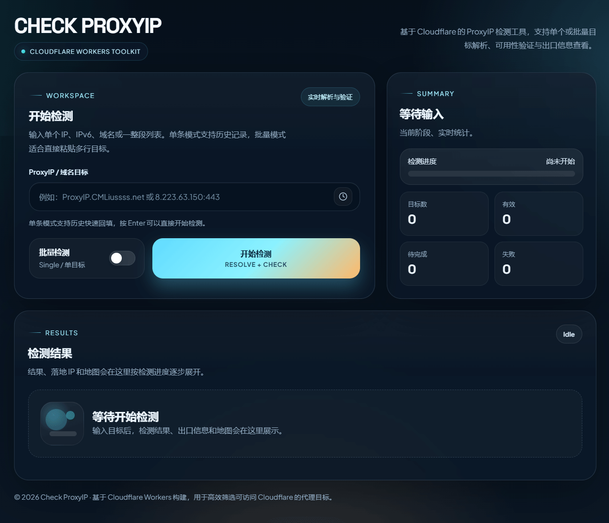

# CF-Workers-CheckProxyIP



一个基于 Cloudflare Workers 的 ProxyIP 检测前端工具。

当前版本的职责很明确：

- 提供一个可直接使用的 Web 界面
- 解析单个或批量输入的 IP / IPv6 / 域名
- 调用外部检测接口校验候选 ProxyIP 是否可用
- 展示出口 IP、地理位置、ASN 信息和地图线路
- 在本地保存最近使用过的单条输入历史

## 项目定位

这个仓库现在是一个单文件 Worker 应用，核心文件只有 [`_worker.js`](./_worker.js)。

它本身不直接在 Worker 内完成 ProxyIP 连通性探测，而是负责：

1. 渲染检测页面
2. 解析输入目标
3. 代理 Cloudflare 机房位置数据
4. 在浏览器中调用外部检测接口并展示结果

这意味着：

- 你部署本项目后，可以立即得到一个可用的检测页面
- 页面中的“检测”动作依赖外部接口 `https://api.090227.xyz/check`
- 如果你希望完全自托管检测链路，需要把前端中的检测接口地址替换成你自己的服务

## 功能特性

### 1. 单目标 / 批量检测

- 支持单条输入
- 支持多行批量输入
- 批量模式下会在前端跳过直接 IP 解析，只解析域名，再以 64 并发发起检测

### 2. 多种目标格式

支持以下输入形式：

| 类型 | 示例 | 说明 |
| --- | --- | --- |
| IPv4 | `8.223.63.150` | 默认端口为 `443` |
| IPv4 + 端口 | `8.223.63.150:8443` | 使用指定端口 |
| IPv6 | `2606:4700::1` | 会在内部标准化为 `[2606:4700::1]:443` |
| IPv6 + 端口 | `[2606:4700::1]:8443` | 推荐使用方括号格式 |
| 域名 | `proxyip.example.com` | 自动解析 `A` / `AAAA` 记录 |
| 域名 + 端口 | `proxyip.example.com:8443` | 所有解析结果沿用该端口 |

### 3. 特殊解析能力

项目当前还内置了两个特殊规则：

- 域名中包含 `.tp端口.` 时，会强制覆盖端口号
  - 例如：`abc.tp8443.example.com`
- 域名中包含 `.william.` 时，会优先查询 `TXT` 记录
  - `TXT` 记录会按逗号拆分为多个候选目标
  - 适合维护一组预定义 ProxyIP 列表

### 4. 结果可视化

- 实时进度条
- Summary 统计卡片
- 成功 / 失败状态标记
- 出口 IP 列表
- 出口国家旗帜
- 出口位置与 Cloudflare 机房连线地图

### 5. 交互体验

- 单条模式支持本地历史记录
- 单条模式按 `Enter` 可直接开始
- 批量模式按 `Ctrl + Enter` 或 `Cmd + Enter` 可直接开始
- 支持通过 URL 路径快速触发一次检测

## 当前架构

```text
浏览器
  ├─ 访问 Worker 首页 /
  ├─ 调用 /resolve 解析输入目标
  ├─ 调用 /locations 获取 Cloudflare 机房位置
  └─ 直接请求外部检测接口 https://api.090227.xyz/check

Cloudflare Worker
  ├─ 返回 HTML / CSS / JS 页面
  ├─ 解析 IPv4 / IPv6 / 域名
  ├─ 通过 DoH 查询 A / AAAA / TXT
  └─ 代理 Cloudflare locations 数据
```

## 项目结构

```text
.
├─ _worker.js   # Worker 入口，包含页面、路由和前端脚本
├─ README.md    # 项目说明
├─ demo.png     # 页面示意图
└─ LICENSE      # MIT 许可证
```

## 路由说明

### `GET /`

返回完整的 Web 检测页面。

页面包含：

- 输入区
- Summary 统计区
- 结果列表
- 地图详情面板

### `GET /resolve?proxyip=...`

解析用户输入，返回一个数组形式的候选目标列表。

#### 请求参数

| 参数 | 类型 | 必填 | 说明 |
| --- | --- | --- | --- |
| `proxyip` | string | 是 | 要解析的 IP、IPv6、域名或域名加端口 |

#### 返回示例

单个 IPv4：

```json
[
  "8.223.63.150:443"
]
```

域名解析为多个候选：

```json
[
  "203.0.113.10:443",
  "203.0.113.11:443",
  "[2001:db8::10]:443"
]
```

#### 解析逻辑

`/resolve` 当前按以下顺序工作：

1. 解析输入中的主机和端口，默认端口为 `443`
2. 如果命中 `.tp端口.` 规则，则覆盖端口
3. 如果输入本身就是 IPv4 / IPv6，则直接返回
4. 如果命中 `.william.` 规则，则优先查询 `TXT`
5. 否则查询 `A` 和 `AAAA` 记录
6. 如果没有得到结果，返回错误信息

#### 错误示例

```json
{
  "error": "Could not resolve domain"
}
```

### `GET /locations`

转发 Cloudflare 官方位置数据：

- 上游地址：`https://speed.cloudflare.com/locations`
- 用于把出口机房 `colo` 映射到实际经纬度
- 供地图详情面板绘制线路使用

### `GET /{target}`

页面还支持“路径直达”用法。

当访问：

```text
https://your-worker.example.workers.dev/8.223.63.150:443
```

前端会自动：

1. 读取路径中的目标
2. 回填到输入框
3. 自动触发一次检测

这对分享某个目标的快速检测链接很方便。

## 页面使用说明

### 单条模式

适合快速验证一个目标：

1. 输入一个 IP、IPv6 或域名
2. 按 `Enter` 或点击 `开始检测`
3. 查看是否可用、响应时间、出口位置和地图信息

单条模式会把最近输入保存到浏览器本地：

- 存储键名：`cf_proxy_history`
- 最多保留 10 条记录

### 批量模式

适合一次性筛选多个目标：

1. 打开“批量检测”开关
2. 每行输入一个目标
3. 按 `Ctrl + Enter` / `Cmd + Enter` 或点击按钮开始

批量模式下：

- 英文逗号和中文逗号都会自动转成换行
- IPv4 / IPv6 会先在浏览器本地识别和归一化，不会提交给 `/resolve`
- 只有域名目标会调用 `/resolve`
- 所有候选目标汇总后会以 32 并发发起检测

### 地图详情

检测成功后，结果卡片中会出现“落地 IP”按钮。

点击后会展示：

- 出口 IP 的经纬度位置
- 对应 Cloudflare 机房位置
- 出口到机房的线路连线

## 外部依赖

当前项目依赖多个外部服务。部署前最好先了解清楚：

| 依赖 | 用途 | 当前地址 |
| --- | --- | --- |
| 外部检测接口 | 检查 ProxyIP 是否可用 | `https://api.090227.xyz/check` |
| Cloudflare DoH | 解析 `A` / `AAAA` / `TXT` | `https://cloudflare-dns.com/dns-query` |
| Cloudflare Locations | 获取机房经纬度 | `https://speed.cloudflare.com/locations` |
| Leaflet | 地图组件 | `https://unpkg.com/leaflet@1.9.4` |
| OpenStreetMap 瓦片 | 地图底图（国际覆盖） | `https://tile.openstreetmap.org/{z}/{x}/{y}.png` |
| 国旗图片 | 出口国家旗帜 | `https://ipdata.co/flags/...` |
| Google Fonts | 页面字体 | `https://fonts.googleapis.com` |

## 关于外部检测接口

前端真正执行检测时，调用的是：

```text
https://api.090227.xyz/check?proxyip=<target>
```

页面当前主要使用它返回的这些字段：

| 字段 | 类型 | 说明 |
| --- | --- | --- |
| `candidate` | string | 当前检测的候选目标 |
| `success` | boolean | 是否判定为可用 |
| `proxyIP` | string | 目标 IP |
| `portRemote` | number | 目标端口 |
| `responseTime` | number | 响应耗时，前端会格式化为毫秒 |
| `colo` | string | 执行检测的 Cloudflare 机房代码 |
| `message` | string | 失败时的附加说明，可能不存在 |
| `probe_results` | object | IPv4 / IPv6 探测结果详情 |

成功结果中，前端会进一步读取：

- `probe_results.ipv4.exit`
- `probe_results.ipv6.exit`

并从中提取：

- `ip`
- `ipType`
- `colo`
- `asn`
- `asOrganization`
- `country`
- `city`
- `loc`

如果你准备替换成自己的检测服务，至少需要兼容上述字段，或者同步修改前端的 `checkIP()` 和结果渲染逻辑。

## 部署方式

### 方式一：Cloudflare Workers 控制台直接部署

这是当前仓库最直接的使用方式。

1. 登录 Cloudflare Dashboard
2. 创建一个新的 Worker
3. 打开在线编辑器
4. 将 [`_worker.js`](./_worker.js) 的内容完整粘贴进去
5. 保存并部署

部署完成后，访问 Worker 地址即可打开页面。

### 方式二：自行接入你已有的 Workers 工程

如果你已经有自己的 Workers 项目，也可以直接：

- 把当前 `_worker.js` 作为入口文件
- 或把其中的 `fetch()` 路由和 `generateHTML()` 页面逻辑合并到现有项目里

由于仓库当前没有附带 `wrangler.toml`，所以默认更偏向“单文件直接部署”的使用方式。

## 自定义建议

如果你准备基于当前项目继续开发，最常见的改动点如下：

### 1. 替换检测接口

当前检测请求写在前端函数 `checkIP()` 中，地址为：

```js
https://api.090227.xyz/check?proxyip=
```

如果你有自己的后端服务，优先改这里。

### 2. 替换 DNS 解析服务

当前 `dohQuery()` 使用的是 Cloudflare DoH：

```text
https://cloudflare-dns.com/dns-query
```

如果你有自己的 DNS over HTTPS 服务，也可以替换。

### 3. 替换地图底图或旗帜资源

当前地图和旗帜都来自第三方资源。如果你的使用环境受限，可以改成你自己的 CDN 或静态资源地址。

## 已知边界

基于当前代码实现，下面这些点需要特别注意：

- 本项目不是“纯本地自包含”检测器，检测结果依赖外部接口可用性
- `/resolve` 只负责解析候选目标，不负责真正的网络可用性验证
- 如果第三方地图、字体、旗帜资源被阻断，页面部分视觉元素可能无法正常显示
- 批量检测时会对候选目标以最多 32 个并发请求执行检测，目标很多时仍可能触发外部接口限流
- 当前仓库没有内置鉴权、配额控制和管理后台

## 适用场景

- 快速筛选一批候选 ProxyIP
- 验证某个域名解析出来的目标是否可作为 ProxyIP
- 观察成功目标的出口位置和网络归属
- 搭一个部署成本很低的 ProxyIP 检测页

## 不再适用旧版 README 的内容

如果你是从旧版本文档迁移过来的，下面几点已经和当前代码不一致：

- 当前仓库没有实现自己的 `/check` Worker 路由
- 当前仓库没有使用 `TOKEN`、`URL302`、`URL`、`ICO` 等环境变量
- 当前部署重点是“检测前端页面 + 目标解析”，不是“全功能后端检测 API”

## Acknowledgements

部分开源代码思路与实现参考自 [@Alexandre_Kojeve](https://t.me/Enkelte_notif/822)。

## License

本项目基于 [MIT License](./LICENSE) 开源。
